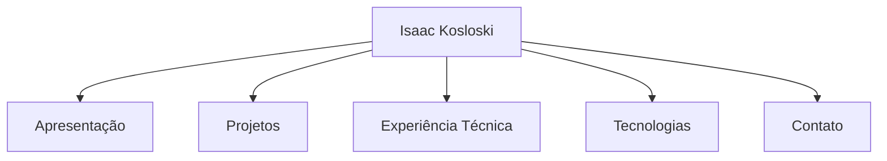

# 🌐 GitHub Pages - Isaac Kosloski

Este repositório contém meu site pessoal desenvolvido com **GitHub Pages** e o tema **minimal**. Ele apresenta meu perfil profissional, projetos em destaque e suporte a **dois idiomas**: 🇧🇷 Português e 🇺🇸 English.

---

## 📁 Estrutura

- `index.md` — Página principal em português  
- `en.md` — Página alternativa em inglês  
- `_config.yml` — Configuração do GitHub Pages com navegação

---

## 🧭 Navegação entre Idiomas

```mermaid
flowchart LR
  index[🇧🇷 index.md (Português)] <--> en[🇺🇸 en.md (English)]
```

---

## 🧠 Visão Geral do Conteúdo



---

## 🚀 Como Publicar

1. Clone ou envie este repositório para sua conta GitHub.
2. Vá até **Settings > Pages** e ative o GitHub Pages na branch `main` (ou `master`) e pasta raiz.
3. Acesse via `https://<seu-usuario>.github.io/`.

---

## 🌍 Acesso Rápido

- 🇧🇷 [Versão em Português](https://isaackosloski.github.io/index.md)
- 🇺🇸 [English Version](https://isaackosloski.github.io/en.md)

---

## ✨ Tecnologias

- [Jekyll Minimal Theme](https://github.com/pages-themes/minimal)
- GitHub Pages
- Markdown
- Mermaid Diagrams

---

> Página desenvolvida por [Isaac Kosloski Oliveira](https://www.linkedin.com/in/isaac-kosloski-oliveira-019625a9/)
