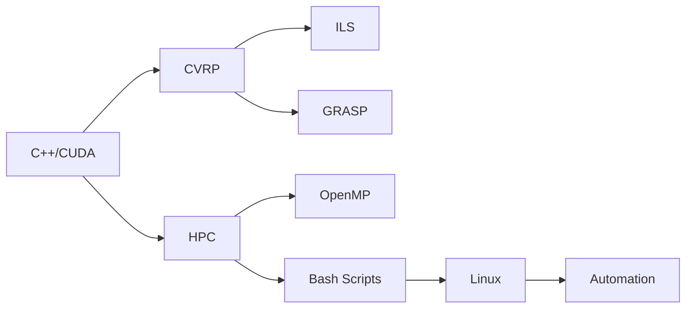

# 👋 Hello, I'm Isaac Kosloski Oliveira

🚀 **Computer Engineer | 🧠 Metaheuristics Researcher | 💻 C++ Developer | ⚙️ Computational Optimization**

I’m a Computer Engineering undergraduate at **UFMS (Brazil)**, passionate about **combinatorial optimization**, **high-performance computing (HPC)**, and developing efficient solutions for complex problems such as the *Capacitated Vehicle Routing Problem (CVRP)*.

I have practical experience with parallel algorithms in **C++/OpenMP/CUDA**, as well as automation and data visualization using **Python + Streamlit**. I build modular, high-performance systems by combining classic algorithms and modern metaheuristics.

[🇧🇷 Versão em Português](./index.md)

---

## 🎯 Fields of Interest

- 🔁 **Metaheuristics:** ILS, GRASP, Simulated Annealing, 2-opt
- 🚚 **Routing Problems:** CVRP, TSP and variants
- ⚙️ **C++ Programming:** Optimized structures and parallelism (OpenMP / CUDA)
- 🐧 **Linux & Bash:** Automation scripts for HPC environments
- 📊 **Interactive Dashboards:** Python + Streamlit + SQLite
- 🧬 **Engineering Data Analysis**

---

## 🧠 Highlighted Projects

| Project | Description | Technologies | Link |
|--------|-------------|--------------|------|
| **CVRP - ILS** | Iterated Local Search solver for CVRP with modular C++ code | `C++`, `OpenMP`, `ILS` | [🔗 View Project](https://github.com/IsaacKosloski/CapacitatedVehicleRoutingProblem-ILS) |
| **CVRP - GRASP** | Greedy randomized heuristic with local search (2-opt, swap) | `C++`, `GRASP` | [🔗 View Project](https://github.com/IsaacKosloski/CapacitatedVehicleRoutingProblem-GRASP) |
| **CVRP Dashboard** | Interactive analysis dashboard with charts and data API | `Python`, `Streamlit`, `SQLite` | [🔗 View Project](https://github.com/IsaacKosloski/CapacitatedVehicleRoutingProblem-Dashboard) |
| **Run Scripts** | Linux bash scripts for parallel execution and benchmarking | `Bash`, `Linux`, `OpenMP` | [🔗 View Scripts](https://github.com/IsaacKosloski/CapacitatedVehicleRoutingProblem-ILS/tree/main/scripts) |

---

## 💼 Technical Experience

- 🧩 **Modular C++ Development:** readable, fast, and extensible
- 🧵 **Parallel Algorithm Design:** with OpenMP and CUDA
- 🔧 **Linux HPC Automation:** managing jobs, logging, performance metrics
- 📈 **Dashboards with Streamlit:** for fast, interactive data insights
- 🛠️ **Software Engineering:** Makefiles, GitHub Actions, CI/CD

---

## 🧰 Tools & Technologies

```text
Languages:
C++ | Python | Bash | CUDA | LaTeX

Performance & Profiling:
OpenMP | CUDA | GProf | Perf | Valgrind

Visualization:
Streamlit | Plotly | Matplotlib

DevOps & Infra:
Linux | Git | GitHub Actions | GCP | Makefile
```

---

## 📚 Publications & Talks

- 🎤 **“ILS for CVRP”**, presented at UFMS Undergraduate Research Conference (2024)
- 📄 Technical documentation in both English and Portuguese
- 📘 Scientific reports built with LaTeX and diagrams (PGFPlots, Mermaid)

---

## 🧭 Why Me?

- 🔍 Strong academic and practical foundation in metaheuristics
- 🧪 Hands-on experience with performance metrics and statistical indicators
- 🌎 Bridging research and engineering through reproducible systems
- 🤝 Clear communication of complex results via dashboards

---

## 📫 Contact

- 💼 [LinkedIn](https://www.linkedin.com/in/isaac-kosloski-oliveira-019625a9/)
- 🐙 [GitHub](https://github.com/IsaacKosloski)
- 📧 Email: [isaac.kosloski@aluno.ufms.br](mailto:isaac.kosloski@aluno.ufms.br)

---

> _"The best solution isn’t always the exact one, but the most efficient."_  
> This page was built with 💡 using **GitHub Pages** + *minimal* theme.


---

## 🔧 Diagram: Skills Overview



---

## 🧪 Diagram: CVRP Solution Flow

```mermaid
flowchart TD
  start([Start]) --> inst[Load .vrp Instance]
  inst --> sol[Run ILS or GRASP]
  sol --> eval[Evaluate Solution]
  eval --> dash[Show in Dashboard]
  dash --> end([End])
```
