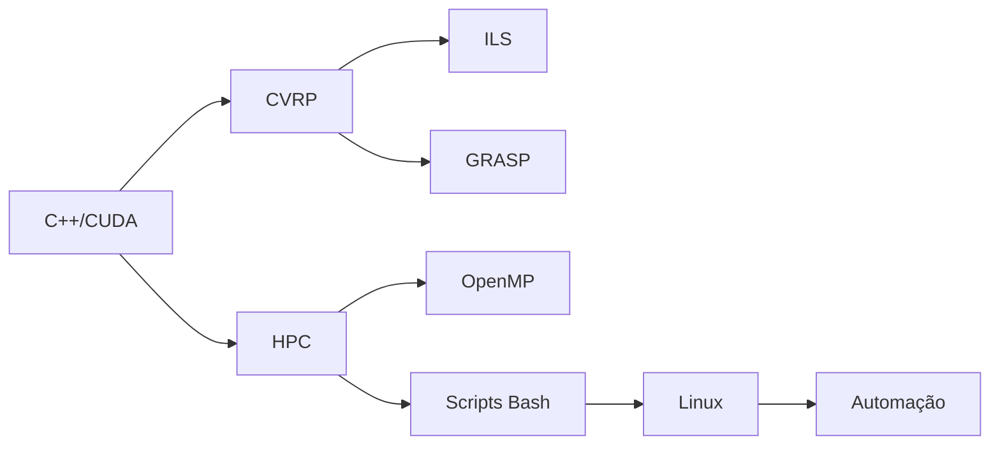

# 👋 Olá, sou Isaac Kosloski Oliveira

🚀 **Engenheiro de Computação | 🧠 Pesquisador em Metaheurísticas | 💻 Desenvolvedor C++ | ⚙️ Otimização Computacional**

Sou graduando em **Engenharia de Computação pela UFMS**, apaixonado por **otimização combinatória**, **alto desempenho computacional (HPC)** e **desenvolvimento de soluções eficientes para problemas complexos** como o *Capacitated Vehicle Routing Problem (CVRP)*.

Minha experiência prática vai de algoritmos paralelos com **C++/OpenMP/CUDA** até automação e visualização de dados com **Python + Streamlit**. Desenvolvo sistemas modulares, robustos e com foco em desempenho — combinando algoritmos clássicos e metaheurísticas modernas.

---

## 🎯 Áreas de Atuação e Interesse

- 🔁 **Metaheurísticas:** ILS, GRASP, Simulated Annealing, 2-opt
- 🚚 **Problemas de Roteamento:** CVRP, TSP e variantes
- ⚙️ **Programação em C++:** Estruturas otimizadas e paralelismo (OpenMP / CUDA)
- 🐧 **Linux & Bash:** Scripts para automação e HPC
- 📊 **Dashboards interativos:** Python + Streamlit + SQLite
- 🧬 **Ciência de Dados Aplicada à Engenharia**

---

## 🧠 Projetos em Destaque

| Projeto | Descrição | Tecnologias | Link |
|--------|-----------|-------------|------|
| **CVRP - ILS** | Solucionador do CVRP com *Iterated Local Search* e modularização clara | `C++`, `OpenMP`, `ILS` | [🔗 Ver Projeto](https://github.com/IsaacKosloski/CapacitatedVehicleRoutingProblem-ILS) |
| **CVRP - GRASP** | Heurística gulosa com busca local otimizada (2-opt e swap) | `C++`, `GRASP` | [🔗 Ver Projeto](https://github.com/IsaacKosloski/CapacitatedVehicleRoutingProblem-GRASP) |
| **CVRP Dashboard** | Visualização interativa com estatísticas, comparações e API de resultados | `Python`, `Streamlit`, `SQLite` | [🔗 Ver Projeto](https://github.com/IsaacKosloski/CapacitatedVehicleRoutingProblem-Dashboard) |
| **Run Scripts** | Scripts para execução paralela de benchmarks com monitoramento de recursos | `Bash`, `Linux`, `OpenMP` | [🔗 Ver Scripts](https://github.com/IsaacKosloski/CapacitatedVehicleRoutingProblem-ILS/tree/main/scripts) |

---

## 💼 Experiência Técnica

- 🧩 **Desenvolvimento Modular em C++:** com foco em legibilidade, desempenho e extensibilidade
- 🧵 **Paralelização de Algoritmos:** usando OpenMP e CUDA para otimização de tempo de execução
- 🔧 **Linux Scripting para HPC:** automação de execuções, benchmarking e logs de desempenho
- 📈 **Dashboards com Python:** visualização dinâmica de estatísticas computacionais com Streamlit e Plotly
- 🛠️ **Engenharia de Software:** Makefiles, versionamento com Git, GitHub Actions

---

## 🧰 Tecnologias e Ferramentas

```text
Linguagens:
C++ | Python | Bash | CUDA | LaTeX

Paralelismo e Desempenho:
OpenMP | CUDA | GProf | Perf | Valgrind

Frameworks e Bibliotecas:
Streamlit | SQLite | Plotly | Matplotlib

DevOps e Ambientes:
Linux | Git | GitHub Actions | GCP | Makefile
```

---

## 📚 Publicações e Apresentações

- 🎤 **“Iterated Local Search aplicado ao CVRP”**, apresentado no Encontro de Iniciação Científica UFMS (2024)
- 📄 Documentação técnica e README de todos os repositórios em português e inglês
- 📘 Produção de relatórios científicos com LaTeX, incluindo diagramas com Mermaid e PGFPlots

---

## 🧭 Diferenciais

- 🔍 Forte base teórica em otimização combinatória e técnicas metaheurísticas
- 🧪 Experiência prática com análises de variabilidade, coeficiente de variação, média, desvio padrão e tempo de execução
- 🌎 Abordagem híbrida: combinação de conhecimento acadêmico com práticas de engenharia de software reais
- 🤝 Capacidade de comunicar resultados complexos por meio de dashboards interativos

---

## 📫 Contato

- 💼 [LinkedIn](https://www.linkedin.com/in/isaac-kosloski-oliveira-019625a9/)
- 🐙 [GitHub](https://github.com/IsaacKosloski)
- 📧 Email: [isaac.kosloski@aluno.ufms.br](mailto:isaac.kosloski@aluno.ufms.br)

---

> _"A melhor solução nem sempre é a exata, mas sim a eficiente."_  
> Esta página foi construída com 💡 usando **GitHub Pages** + tema *minimal*.


---

## 🔧 Diagrama: Organização das Habilidades



---

## 🧪 Diagrama: Fluxo de Solução para o CVRP

```mermaid
flowchart TD
  start([Início]) --> inst[Carregar Instância .vrp]
  inst --> sol[Aplicar ILS ou GRASP]
  sol --> eval[Analisar Solução]
  eval --> dash[Visualizar em Dashboard]
  dash --> end([Fim])
```
